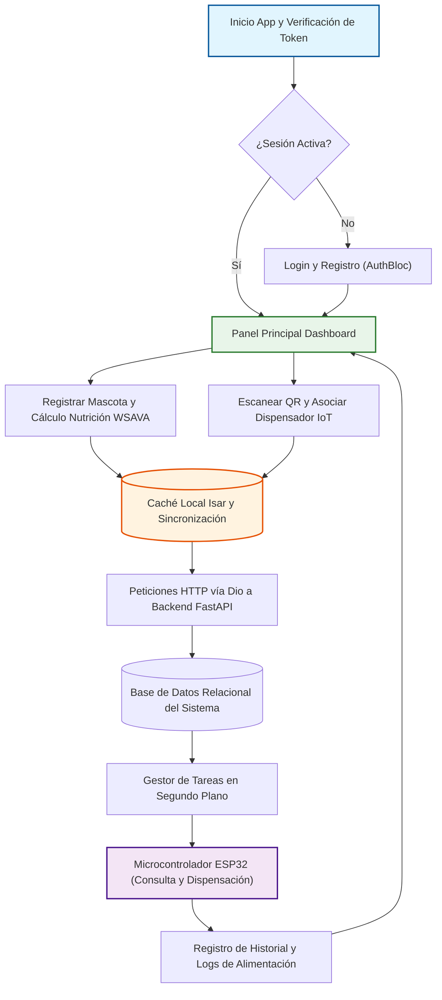

# Documentación de Arquitectura y Diagrama de Flujo General del Sistema PDAM

## 1. Introducción y Arquitectura General del Sistema

El sistema **PDAM (Plataforma de Dosificación y Automatización de Mascotas)** es una solución integral compuesta por tres capas tecnológicas principales que operan de manera sincronizada:

1. **Aplicación Móvil (Flutter):** Interfaz cliente multiplataforma para el usuario final, construida con Clean Architecture y BLoC. Soporta funcionamiento offline mediante almacenamiento local (Isar) y comunicación HTTP sincronizada con Dio.
2. **Backend / API REST (Python / FastAPI):** Servidor central encargado de la lógica de negocio, autenticación JWT, gestión de usuarios, perfiles de mascotas, algoritmos de dosificación nutricional (estándares WSAVA), control de dispensadores y tareas en segundo plano.
3. **Dispositivo Hardware IoT (ESP32 / Arduino):** Microcontrolador conectado a internet que interactúa con el backend para recibir comandos de dispensación automatizada o manual y reportar el estado del dispensador.

---

## 2. Diagrama de Flujo General del Sistema (Mermaid)

El siguiente diagrama detalla de forma estructurada el flujo operativo completo del sistema:

---

## 3. Descripción Detallada del Flujo del Sistema

1. **Autenticación y Acceso:**
   - El usuario abre la aplicación móvil. El sistema verifica si existe un token de sesión válido almacenado localmente.
   - Si no está autenticado, el usuario ingresa sus credenciales en la pantalla de inicio de sesión (`LoginView`), las cuales son validadas por el endpoint de autenticación del Backend (`FastAPI`). Al autenticarse con éxito, se emite un token JWT que se almacena de forma segura.

2. **Gestión Nutricional y de Mascotas:**
   - Desde el panel principal, el usuario puede registrar o modificar los datos de su mascota (especie, peso, edad, nivel de actividad).
   - El sistema aplica las directrices nutricionales para calcular la porción exacta de alimento y generar los horarios de dispensación automatizada.
   - Los datos se sincronizan con la base de datos relacional del backend y se respaldan localmente en la base de datos **Isar** para garantizar disponibilidad sin conexión a internet.

3. **Asociación y Control del Dispensador IoT:**
   - El usuario utiliza la cámara del móvil para escanear el código QR único impreso en el dispensador inteligente.
   - La aplicación valida el código QR y solicita la asociación del dispositivo con el perfil de la mascota a través de la API REST.
   - El backend registra la asociación en el sistema.

4. **Automatización y Ejecución Física (Hardware):**
   - El backend gestiona tareas en segundo plano que controlan los horarios programados de alimentación.
   - El dispositivo IoT (**ESP32**) consulta periódicamente al backend las tareas pendientes.
   - Al cumplirse la hora programada, el ESP32 activa el mecanismo físico de dispensación, alimenta a la mascota y reporta el registro de éxito (`Log`) de vuelta a la API, cerrando el ciclo operativo del sistema.
