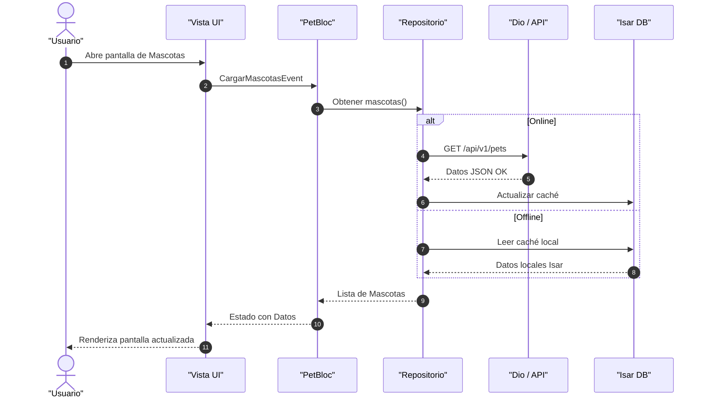

# Documentación de Arquitectura y Diagramas de Secuencia - Aplicación Móvil PDAM

## 1. Análisis Mobile y Arquitectura

La aplicación móvil **PDAM** está desarrollada en **Flutter** bajo un enfoque de **Clean Architecture** combinada con gestión de estado reactiva basada en **BLoC/Cubit**, inyección de dependencias con **GetIt**, enrutamiento avanzado con **GoRouter** (integrado con reautenticación reactiva mediante `BlocRefreshListenable`), comunicación HTTP con **Dio** y persistencia local/offline con **Isar**.

### Componentes Clave:
- **Capa de Presentación (Presentation):** 
  - Vistas y pantallas organizadas por dominios funcionales (`auth`, `dashboard`, `pets`, `dispenser`, `logs`).
  - Uso de componentes de diseño adaptativo inspirados en Material Design 3 (`MainNavigationShell`, tarjetas métricas, gráficos, listados reactivos).
  - Cubits y Blocs específicos (`AuthBloc`, `DashboardCubit`, `PetBloc`, `ScheduleBloc`, `DispenserBloc`, `LogBloc`).
- **Capa de Dominio (Domain):**
  - Entidades de negocio (`User`, `Pet`, `Schedule`, `Dispenser`, `DashboardSummary`).
  - Casos de uso (`UseCases`) que encapsulan la lógica de negocio pura.
  - Contratos de repositorios (`Repositories`).
- **Capa de Datos (Data):**
  - Implementaciones de repositorios.
  - Fuentes de datos remotas (`RemoteDataSources`) mediante clientes HTTP (`DioClient` con interceptores de autenticación `AuthInterceptor`).
  - Fuentes de datos locales (`LocalDataSources`) y servicios de almacenamiento persistente (`IsarService`, `StorageService`) para modo offline (registros, caché de mascotas, tareas pendientes).
- **Servicios Auxiliares:**
  - Validador de códigos QR (`QrValidator`) y validadores de tiempo (`ValidateTime`).

---

## 2. Diagrama de Secuencias (Flujo de Carga y Sincronización)

El siguiente diagrama muestra de forma compacta y directa la secuencia de carga y sincronización de datos de mascotas:

---

## 3. Explicación Detallada por Secuencias

A continuación se detalla formalmente cada paso de la secuencia descrita en el flujo móvil:

1. **Interacción Inicial del Usuario:** El usuario navega hacia la pantalla de gestión de mascotas (`PetsView`) a través del shell de navegación principal (`MainNavigationShell`). La vista detecta el ciclo de vida de inicialización y solicita la carga de datos.
2. **Disparo de Evento en el BLoC:** La interfaz (`PetsView`) comunica la acción enviando un evento de tipo `CargarMascotasEvent` hacia el gestor de estado correspondiente (`PetBloc`).
3. **Solicitud al Repositorio:** El `PetBloc` invoca el caso de uso y método correspondiente en el repositorio de mascotas (`PetsRepository`).
4. **Evaluación de Conectividad y Estrategia de Datos (Repository Pattern):**
   - **Camino Online:** Si el dispositivo posee conexión activa, el repositorio realiza una petición HTTP GET a través del cliente `DioClient` (`/api/v1/pets`), adjuntando las credenciales de autorización mediante el interceptor de tokens (`AuthInterceptor`). Al recibir una respuesta exitosa (HTTP 200), los datos obtenidos son mapeados y almacenados transaccionalmente en la base de datos local **Isar** para garantizar la persistencia offline.
   - **Camino Offline:** Si ocurre un fallo de red o el dispositivo se encuentra desconectado, el repositorio intercepta la excepción, recurre al origen de datos local (`LocalPetDatasource`) y recupera la última versión en caché almacenada en **Isar**.
5. **Retorno de Entidades al Gestor:** El repositorio devuelve un listado limpio de objetos de dominio (`List<Pet>`) al `PetBloc`.
6. **Resolución y Actualización de la Interfaz:**
   - Si la operación se completa con éxito, el `PetBloc` emite el estado `EstadoCargadoPet` conteniendo las mascotas. La interfaz reconstruye sus widgets hijos (`PetsList`, `PetNutritionalSummaryCard`) mostrando la información actualizada al usuario.
   - Si se produce un error crítico no recuperable, se emite `EstadoErrorPet`, permitiendo a la UI mostrar un componente de reintento o notificación visual adecuada.
