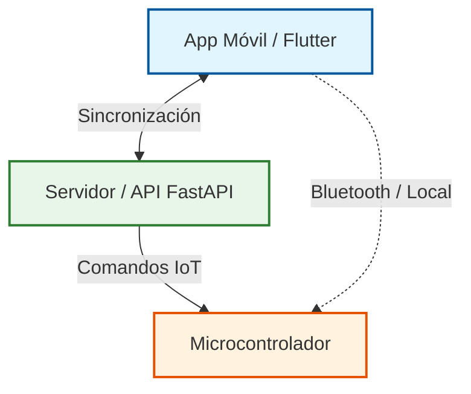

# Diagrama de Arquitectura del Sistema PDAM

Este documento contiene el diagrama de arquitectura simplificado del sistema, diseñado para visualizarse de forma nativa en Obsidian mediante Mermaid.

## Arquitectura General

## Componentes del Sistema

1. **App Móvil / Flutter**: Interfaz de usuario para la gestión de mascotas, visualización de horarios y control manual de dosificación. Mantiene comunicación bidireccional con el servidor.
2. **Servidor / API FastAPI**: Núcleo backend que procesa la lógica de negocio, autenticación, base de datos y coordinación de tareas.
3. **Microcontrolador**: Dispositivo físico (IoT) que recibe las instrucciones enviadas por el servidor para ejecutar la dispensación de alimento.
